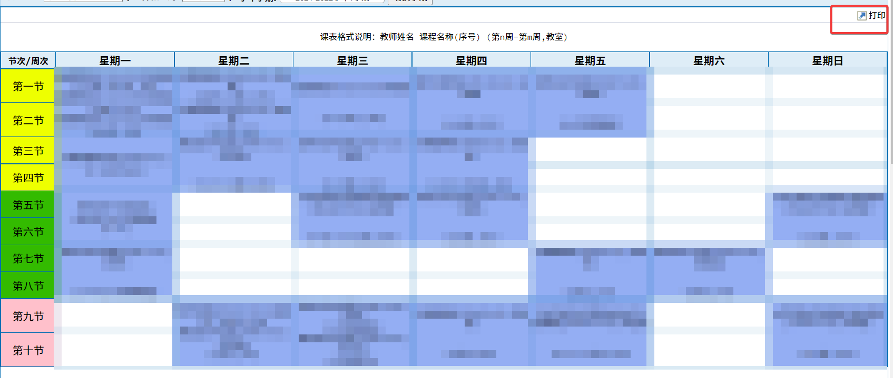
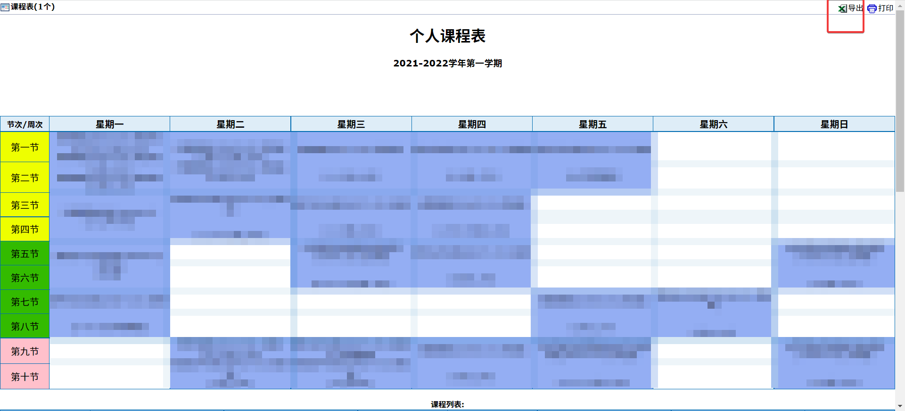
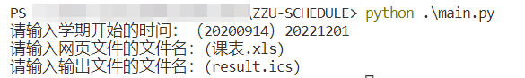
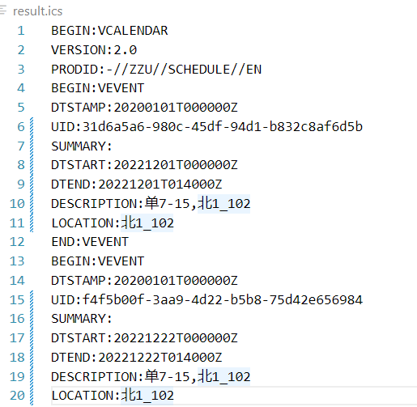

# ZZU-SCHEDULE
郑州大学课程表ics导出工具 

Zhengzhou University Course Schedule Export Tool

---

## 使用说明

1. 克隆本项目

```shell
git clone https://github.com/wcwac/ZZU-SCHEDULE.git
```

2. 登陆教务系统，下载课程表文件

 



3. 将课程表文件放至项目文件夹中


4. 在cmd中运行main.py，并输入需要的信息

```shell
python main.py
```



5. 检查输出的课程表文件



本项目理论上对类似的教务系统有效（特征：/eams/courseTableForStd!courseTable.action）
